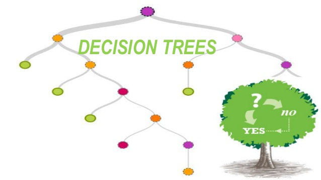

# Machine Learning in Practice
Machine Learning in Practice with python librarys (Pandas &amp; Numpy &amp; scikit-learn) alongside  with machine learning classifiers Decision Tree(DT), LinearRegression(LR) and Quandl API.
```diff
- Python version: 3.8.0
- Python Libraries: (NumPy): pip install numpy, (Pandas): pip install pandas, (SkLearn): pip install scikit-learn
```



